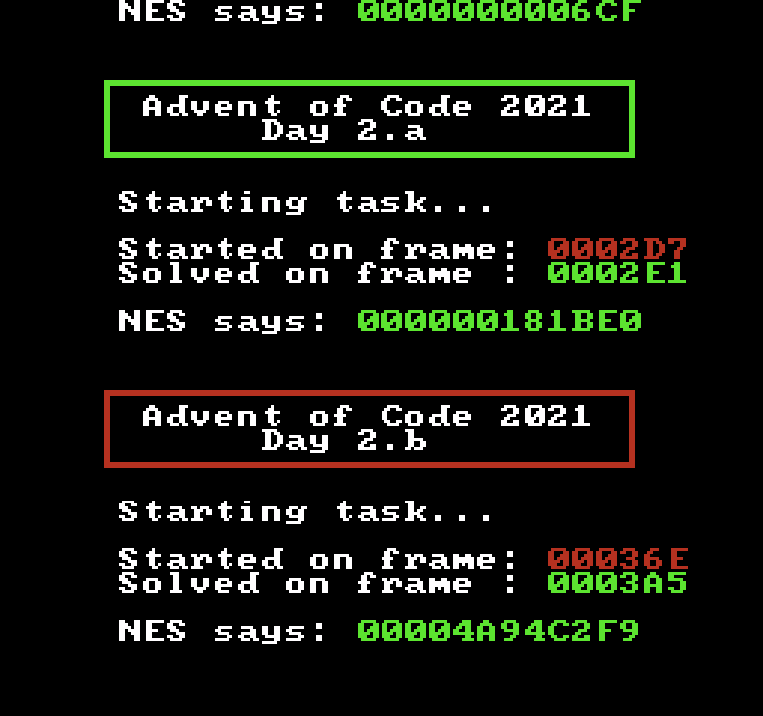

# Advent of Code 2021 - On an NES

Quest to complete Advent of Code 2021 on a unmodified 8-bit NES.

Should (and does) run on physical hardware. Uses MMC1 with 0x2000 (+0x800) bytes of RAM. Some of the challenges take **way** over an hour to compute the answer for. Does **not** work with PowerPAK (dont know why and at this point, I dont care).

If you hate yourself and want to watch it for the serveral hours it takes to complete, just:

1) `(cd nesasmsrc && gcc *.c -o ../nesasm-fix)` to build the modified (required) nesasm version.
2) `./build.sh`
3) Run it and wait a brief eternity for it to finish. The awesome christmas tune was ripped from [here](https://www.bilibili.com/video/BV1nh411f77p/). Music does not loop so the vast majority of execution is spent in silent anguish.

**EDIT:** I just added the ROM image... Just load it in your favorite emulator or write to cart.

**Days completed:** 1,2,3,4,5,6,7,8,9,10,11.

